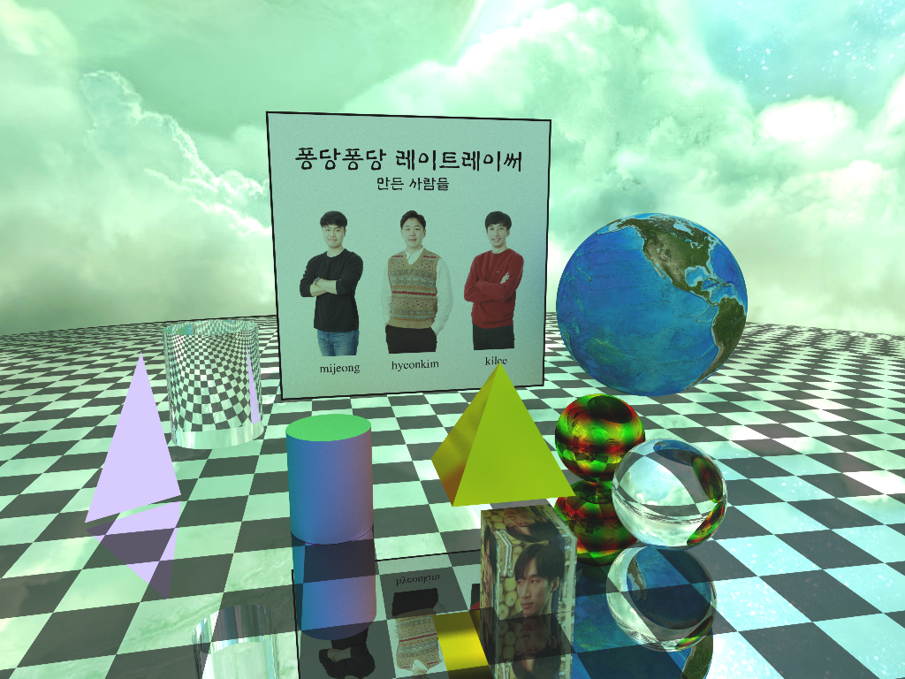

##  선택 과제인듯 아닌듯한 2서클

42서울 커리큘럼 공통과정(Core circle)에서 초반에 가장 넘기 어려운 구간은 2서클의 Cub3D와 miniRT 라는 이름의 선택과제로 구성된, 컴퓨터 그래픽 실습이다. 선택과제이긴 하지만 대부분의 학생들이 Cub3D를 선택한다고 한다. 그 이유는 여러가지겠지만, 가장 큰 이유는 C 코드 예제와 한글로 만들어진 실습 교재의 부족(나는 찾지  못하였지만 존재할지도 모르니 부재라는 표현을 사용하지 않았다)이 결정적이라고 생각된다. 컴퓨터 그래픽 프로그래밍에 대한 경험이 없는, 심지어 프로그래밍 경험도 42서울에서가 전부이고 영어도 능숙하지 못 한 나 같은 학생들에게는 더 높은 장벽으로 느껴질 것이었다. 이는 miniRT라는 과제가 점점 버려질 수 밖에 없는 순환고리를 만들게 된다.

## miniRT로 결정

개포동 클러스터가 코로나 2단계로 임시 폐쇠되기전까지 '개포 모닝 이글즈'라는 누구나 들어오고 싶을 만한 멋진 이름의 아침 스터디에 참여하고 있었다. 클러스터가 폐쇠될 즈음 스터디 수장인 hyeonkim이 miniRT를 하고 싶다고 했다. 1서클을 진행 중이던 우리는 사실 다음 서클의 과제에 대해 잘 알지 못하였고, 왜 그걸 하고 싶은지 물었다. 

> "Cub3D는 레퍼런스가 많은데 miniRT는 거의 없대! 우리가 만들자!"

hyeonkim의 말에 혹한 나와 mijeong까지 3인의 miniRT 팀이 꾸려졌다. 그 뒤 이 팀은 약 2개월 동안 머리 숱이 많이 줄었다.

## 과제 종료와 실습 교재 작성의 시작

함께 고군분투하여 결국 모두 최고점을 획득하며 과제를 성공적으로 마치게 되었다. 고통 받았다고 했지만, 함께 영문 레퍼런스를 읽고 번역하고, 점진적으로 프로그램을 개발, 개선해 나아가며 많은 것을 배운 값지고 즐거운 시간이었다. 개인적으로 이번 과제에서 'Code는 정말 강력하고 아름다운 창조의 도구'라는 생각을 얻게되었다. 그리고 내가 아직은 미숙하지만 이 도구를 사용할 수 있게 되었다는 사실이 너무 감사하게 느껴졌다. (앞으로 이 도구를 정말 잘 다루는 장인이 되고 싶어졌다..) 벅찬 마음은 넣어두고, 이제 남은 일은 과제를 수행하며 극복한 여러 난관들을 현재 또는 미래의 42동료들을 위해 기록으로 남기는 것이다. 

과제를 수행하며 알게된 Ray tracing이라는 기술은 이를 이해하고 사용하기 위해서 많은 기반 지식(수학, 물리)을 요구하며, 최적화의 영역(실시간 레이트레이싱등을 위한)으로 나아간다면, 훨씬 더 넓은 범위의 복합적인 기술 지식을 요구한다는 점이다. 하지만 다행히 과제에서 요구하는 레이트레이서는 가장 기초적인 수준을 요구하기 때문에(그럼에도 우리에게 충분히 고통을 줄) 과제 공식 문서 초입에 말한 것처럼, 지식의 벽 앞에서 평정심을 유지하고, 깊은 호흡으로 멘탈을 꽉 잡는다면 충분히 멋진 이미지를 얻을 수 있을 것이다.

> The main goal of miniRT is to prove to yourself that you are able to implement any mathematics or physics formulas without being a mathematician, we will only implement the most basics ray tracing features here so just keep calm, take a deep breath and don’t panic! 

우리는 miniRT를 선택한 동료들이 평정심을 잃지 않고 나아가는데 기여할 수 있는 교재를 만들고자 한다. 기초적인 수준의 지식이라 하더라도 Raytracer를 개발하는데에 필요한 지식은 대부분의 교육생들에게는 충분히 부담스러울 만하다. 여러 수학, 물리적인 개념을 완벽히는 아니더라도 사용할 수 있을 정도는 이해해야만 한다. 해서 실습 교재는 필요한 각각의 지식을 깊이 다루기보다는, 도구로 사용할 수 있을 정도의 이해를 돕기 위한 수준의 설명과 예제코드 중심으로 구성하려 한다. 정확한 이해가 필요한 개념에 대한 설명은 우리가 도움을 받은 레퍼런스들과 필요에 따라 이 레퍼런스들의 번역문을 통해 제공하고자 한다. 

어느정도 시간이 걸릴지 모르겠지만, 최대한 빠르게 초안을 만들어 공유하여 더 빠르게 miniRT과제를 수행하고 있는 동료들에게 도움을 주고싶다. 교재의 부족한 부분들의 개선은 동료들의 피드백으로 가능하지 않을까?

## 마치며

앞으로 같은 제목으로 시작하는 시리즈 형태의 포스팅으로 교재를 연재하고 완성된 교재는 깃허브에 업로드 하려한다.

내가 완성한 레이 트레이서를 통해 만든 이미지들을 마지막으로 마친다.

